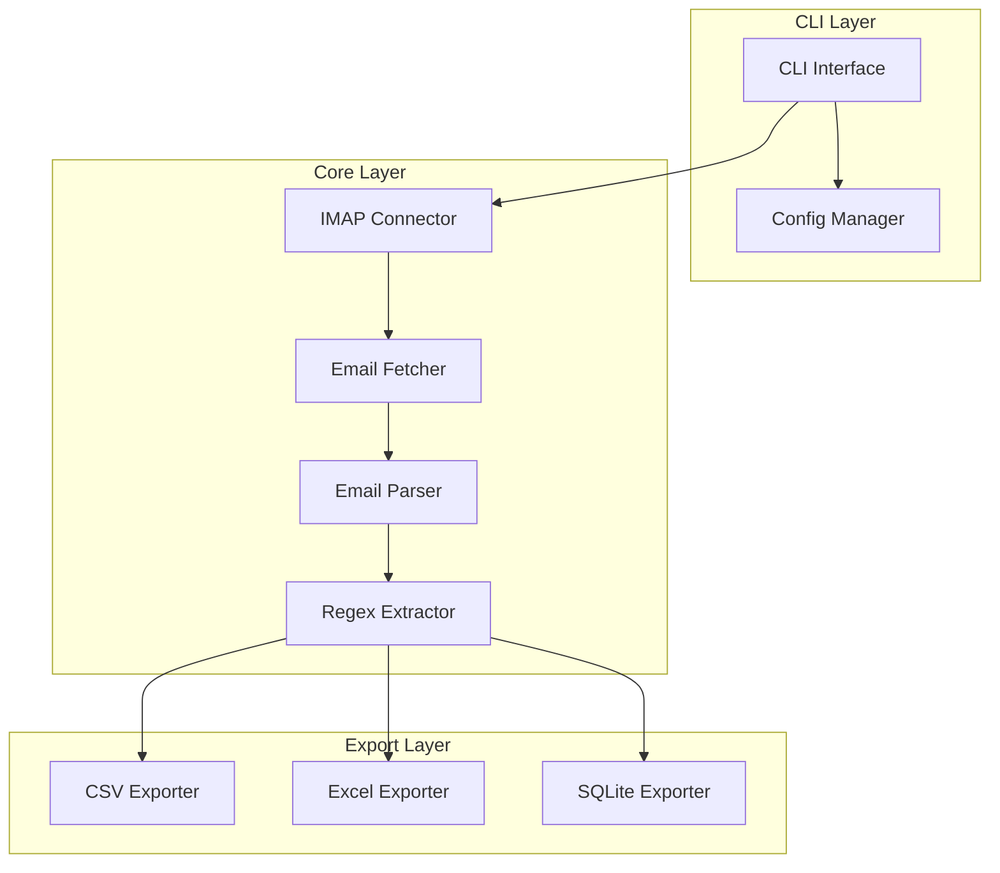

# Design Document: Yahoo Mail Extractor

## Overview

Yahoo Mail Extractor 是一个基于 Node.js/TypeScript 的命令行工具，通过 IMAP 协议连接 Yahoo Mail，批量提取邮件内容，使用正则表达式提取关键信息，并导出为多种格式。

### 技术栈
- **语言**: TypeScript (Node.js)
- **IMAP 库**: `imap` 或 `imapflow`
- **邮件解析**: `mailparser`
- **Excel 导出**: `exceljs`
- **CSV 导出**: 内置 `fs` + 自定义格式化
- **数据库**: `better-sqlite3`
- **CLI**: `commander`
- **测试框架**: `vitest` + `fast-check` (属性测试)

## Architecture



## Components and Interfaces

### 1. IMAP Connector (`src/connector.ts`)

负责建立和管理与 Yahoo Mail 服务器的 IMAP 连接。

```typescript
interface IMAPConfig {
  email: string;
  password: string;  // App Password
  host: string;      // imap.mail.yahoo.com
  port: number;      // 993
  tls: boolean;      // true
}

interface ConnectionResult {
  success: boolean;
  error?: string;
  connection?: IMAPConnection;
}

class IMAPConnector {
  connect(config: IMAPConfig): Promise<ConnectionResult>;
  disconnect(): Promise<void>;
  listFolders(): Promise<string[]>;
}
```

### 2. Email Fetcher (`src/fetcher.ts`)

根据过滤条件从邮箱获取邮件。

```typescript
interface FetchFilter {
  folder?: string;        // 默认 'INBOX'
  dateFrom?: Date;
  dateTo?: Date;
  sender?: string;
  subject?: string;
}

interface RawEmail {
  uid: number;
  date: Date;
  from: string;
  subject: string;
  body: string;
  html?: string;
}

class EmailFetcher {
  fetch(connection: IMAPConnection, filter: FetchFilter): AsyncGenerator<RawEmail>;
  count(connection: IMAPConnection, filter: FetchFilter): Promise<number>;
}
```

### 3. Email Parser (`src/parser.ts`)

解析邮件内容，处理 MIME 格式和编码。

```typescript
interface ParsedEmail {
  uid: number;
  date: Date;
  from: string;
  subject: string;
  textContent: string;
  htmlContent?: string;
}

class EmailParser {
  parse(raw: Buffer): Promise<ParsedEmail>;
  stripHtml(html: string): string;
}
```

### 4. Regex Extractor (`src/extractor.ts`)

使用正则表达式从邮件内容中提取信息。

```typescript
interface ExtractionPattern {
  name: string;
  pattern: string;  // 正则表达式字符串
  flags?: string;   // 'g', 'i', 'gi' 等
}

interface ExtractionMatch {
  fullMatch: string;
  groups: Record<string, string>;  // 命名捕获组
  index: number;
}

interface ExtractionResult {
  email: ParsedEmail;
  matches: ExtractionMatch[];
  patternName: string;
}

class RegexExtractor {
  extract(email: ParsedEmail, pattern: ExtractionPattern, stripHtml?: boolean): ExtractionResult;
  extractBatch(emails: ParsedEmail[], pattern: ExtractionPattern): ExtractionResult[];
}
```

### 5. Exporters (`src/exporters/`)

#### CSV Exporter
```typescript
interface CSVExportOptions {
  outputPath: string;
  delimiter?: string;
  includeHeaders?: boolean;
}

class CSVExporter {
  export(results: ExtractionResult[], options: CSVExportOptions): Promise<void>;
  serialize(results: ExtractionResult[]): string;
  deserialize(csv: string): ExtractionResult[];
}
```

#### Excel Exporter
```typescript
interface ExcelExportOptions {
  outputPath: string;
  sheetName?: string;
}

class ExcelExporter {
  export(results: ExtractionResult[], options: ExcelExportOptions): Promise<void>;
}
```

#### SQLite Exporter
```typescript
interface DBExportOptions {
  dbPath: string;
  tableName?: string;
}

class SQLiteExporter {
  export(results: ExtractionResult[], options: DBExportOptions): Promise<void>;
  query(dbPath: string, sql: string): Promise<any[]>;
}
```

### 6. Config Manager (`src/config.ts`)

管理提取配置的序列化和反序列化。

```typescript
interface ExtractorConfig {
  imap: Omit<IMAPConfig, 'password'>;  // 不保存密码
  filter: FetchFilter;
  pattern: ExtractionPattern;
  export: {
    format: 'csv' | 'excel' | 'sqlite';
    options: CSVExportOptions | ExcelExportOptions | DBExportOptions;
  };
}

class ConfigManager {
  save(config: ExtractorConfig, path: string): Promise<void>;
  load(path: string): Promise<ExtractorConfig>;
  validate(config: unknown): config is ExtractorConfig;
  serialize(config: ExtractorConfig): string;
  deserialize(json: string): ExtractorConfig;
}
```

## Data Models

### Email Record
```typescript
interface EmailRecord {
  uid: number;
  messageId: string;
  date: Date;
  from: string;
  to: string[];
  subject: string;
  textContent: string;
  htmlContent?: string;
  extractedData: Record<string, string[]>;
}
```

### Export Record (for CSV/Excel/DB)
```typescript
interface ExportRecord {
  emailUid: number;
  emailDate: string;      // ISO format
  emailFrom: string;
  emailSubject: string;
  matchIndex: number;
  fullMatch: string;
  [groupName: string]: string | number;  // 动态命名捕获组
}
```

## Correctness Properties

*A property is a characteristic or behavior that should hold true across all valid executions of a system-essentially, a formal statement about what the system should do. Properties serve as the bridge between human-readable specifications and machine-verifiable correctness guarantees.*

### Property 1: Configuration Round-Trip Consistency
*For any* valid ExtractorConfig object, serializing it to JSON and then deserializing should produce an equivalent configuration object.
**Validates: Requirements 6.1, 6.2**

### Property 2: Date Filter Correctness
*For any* date range filter and set of emails, all returned emails should have dates within the specified range (inclusive).
**Validates: Requirements 2.1**

### Property 3: Sender Filter Correctness
*For any* sender filter pattern and set of emails, all returned emails should have sender addresses matching the filter pattern.
**Validates: Requirements 2.2**

### Property 4: Subject Filter Correctness
*For any* subject filter pattern and set of emails, all returned emails should have subjects matching the filter pattern.
**Validates: Requirements 2.3**

### Property 5: Regex Extraction Completeness
*For any* valid regex pattern and email content, the extractor should return all non-overlapping matches present in the content.
**Validates: Requirements 3.1, 3.2**

### Property 6: Named Capture Group Preservation
*For any* regex pattern with named capture groups, the extraction result should contain all named groups with their correct values.
**Validates: Requirements 3.3**

### Property 7: HTML Strip Consistency
*For any* HTML content, stripping HTML tags should produce text that contains no HTML tag characters (< or >) except in text content.
**Validates: Requirements 3.6**

### Property 8: CSV Export Validity
*For any* set of extraction results, the generated CSV should be parseable back to equivalent data records.
**Validates: Requirements 4.1**

### Property 9: Export Metadata Completeness
*For any* exported record, the output should contain all required metadata fields (uid, date, from, subject).
**Validates: Requirements 4.4**

### Property 10: Error Resilience
*For any* batch of emails where some fail to process, the extractor should continue processing and return results for all successful emails.
**Validates: Requirements 5.2**

### Property 11: Config Validation Correctness
*For any* invalid JSON structure, the config deserializer should throw a descriptive error rather than returning invalid data.
**Validates: Requirements 6.4**

## Error Handling

### Connection Errors
- **AuthenticationError**: 凭据无效时抛出，包含清晰的错误消息
- **ConnectionError**: 网络问题时抛出，包含重试建议
- **TimeoutError**: 连接超时时抛出

### Processing Errors
- **ParseError**: 邮件解析失败时记录并跳过
- **ExtractionError**: 正则提取失败时记录并继续
- **ExportError**: 导出失败时抛出，包含详细原因

### Error Recovery Strategy
```typescript
interface ProcessingError {
  emailUid: number;
  stage: 'fetch' | 'parse' | 'extract' | 'export';
  error: Error;
  timestamp: Date;
}

class ErrorCollector {
  errors: ProcessingError[] = [];
  add(error: ProcessingError): void;
  getSummary(): { total: number; byStage: Record<string, number> };
}
```

## Testing Strategy

### Unit Testing (Vitest)
- 测试各组件的独立功能
- 使用 mock 模拟 IMAP 连接
- 测试边界条件和错误处理

### Property-Based Testing (fast-check)
- **库**: `fast-check` - JavaScript/TypeScript 的属性测试库
- **配置**: 每个属性测试运行至少 100 次迭代
- **标注格式**: 每个属性测试必须包含注释 `**Feature: yahoo-mail-extractor, Property {number}: {property_text}**`

#### 属性测试覆盖
1. **配置序列化**: 测试 JSON 序列化/反序列化的往返一致性
2. **过滤器正确性**: 测试日期、发件人、主题过滤器的正确性
3. **正则提取**: 测试提取完整性和命名捕获组保留
4. **HTML 处理**: 测试 HTML 标签剥离的正确性
5. **CSV 导出**: 测试 CSV 生成和解析的往返一致性

### Integration Testing
- 使用真实 Yahoo 账号进行端到端测试
- 测试完整的提取和导出流程

### Test File Structure
```
src/
├── connector.ts
├── connector.test.ts
├── fetcher.ts
├── fetcher.test.ts
├── parser.ts
├── parser.test.ts
├── extractor.ts
├── extractor.test.ts
├── config.ts
├── config.test.ts
└── exporters/
    ├── csv.ts
    ├── csv.test.ts
    ├── excel.ts
    ├── excel.test.ts
    ├── sqlite.ts
    └── sqlite.test.ts
```
